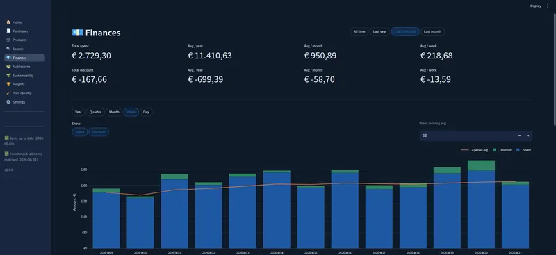

# AH Purchases Insights

Analyzes your Albert Heijn grocery purchases to provide insights into your spending, nutrition, and sustainability impact.

## What it does

This project syncs your Albert Heijn receipts and online orders into a local database and shows the results in an interactive dashboard. It helps you understand your grocery shopping from several angles (what you spend and where your money goes, the nutritional profile of what you buy, and the environmental impact of your purchases), broken down by category, over time, and per individual receipt or order.

Each product is enriched once in the backend: it gets a CO₂eq estimate, a resolved per-unit weight, and a Nutri-Score, so the dashboard can report financial, nutritional, and sustainability statistics side by side.

### Dashboard features



- **Home**: purchase counts, spending summary, Nutri-Score distribution, and top products at a glance
- **Period filters**: All time / Last month / Last 3 months pills scope all displayed stats to the selected window, persisted across pages
- **Finances**: spending over time, category breakdown, and top discounts
- **Purchases**: unified list of receipts and online orders; click any row for a per-receipt or per-order detail view with product-level breakdown
- **Insights**: top products ranked by frequency, spend, CO₂eq emissions, or weight
- **Nutri-Score**: Nutri-Score distribution across purchased products with per-score drilldown
- **Sustainability**: Chart with CO₂eq trend, Dutch average and sustainable target (EAT-Lancet) reference lines, and interactive category breakdown with per-category drilldown
- **Search**: full-text search across products, receipt items, and order items
- **Data Quality**: highlights issues with interpreting the data, allowing for manual fixes via corrections
- **Light/dark theme**: instant theme toggle, persisted across the dashboard

## How it works

1. **Login**: an OAuth flow authenticates you against the AH API and saves a token locally; triggered from the dashboard on first run (and again whenever the token expires)
2. **Sync**: fetches your receipts, orders, and product metadata into a local SQLite database
3. **Enrich**: classifies each unique product once through a CO₂eq pipeline:
   - Manual corrections (highest priority)
   - Vegan-variant and AH subcategory direct lookup
   - Non-food category detection (excluded from CO₂ totals)
   - Per-unit weight resolution from unit size, net content, multipack, or per-piece estimates
4. **Dashboard**: Streamlit app that fetches results from the backend HTTP API and renders them

## Services

| Service     | Language | Role                                                                                                             |
| ----------- | -------- | ---------------------------------------------------------------------------------------------------------------- |
| `backend`   | Go       | Syncs receipts/orders from AH API; enriches products with CO₂eq data; handles OAuth login; HTTP API on port 8001 |
| `dashboard` | Python   | Streamlit visualisation, corrections, and product mapping UI                                                     |

## Privacy and credentials

Your AH credentials never leave your machine. The login flow performs the same OAuth exchange the official AH app uses; the resulting token is written to `config/appie.json` inside a Docker named volume (`appie-config`). This file is listed in `.gitignore` and will never be committed to the repository. All grocery data is stored in a local SQLite database (`data/groceries.db`), also excluded from version control. Nothing is sent to any third-party service.

**Network exposure:** the backend HTTP API (port 8001) has **no authentication**; it is designed for single-user, local use only. Because the backend container runs with `network_mode: host` (needed for the OAuth login callback), port 8001 is bound to all interfaces on the host. Run this only on a machine and network you trust, and do **not** port-forward or otherwise expose port 8001 to the public internet. Anyone who can reach it can read your data and trigger destructive endpoints (e.g. database reset).

## Getting started

### With Docker (recommended)

**Prerequisites:** Docker and Docker Compose.

```bash
./run.sh
```

Builds and starts all services, then opens the dashboard at `http://localhost:8501`. On first run, the dashboard will prompt you to log in; clicking the button opens an Albert Heijn OAuth flow in your browser. Once authenticated, the backend syncs your receipts and classifies products automatically.

### Without Docker (local)

**Prerequisites:** Go 1.23+ and Python 3.12+.

```bash
./run-local.sh
```

Runs the Go backend and the Streamlit dashboard as native processes — no containers. On first run it creates a Python virtualenv in `.venv-dashboard/` and installs the dashboard's dependencies. Both processes are stopped together on `Ctrl-C`.

The two scripts use the same defaults, so they interoperate: data is stored in `data/groceries.db` and your AH token in `~/.config/appie/appie.json`. (Note that the Docker setup keeps the token in a named volume instead — see [Data](#data) — so you may need to log in again the first time you switch between the two.)

## Data

| Path                     | Description                                                                        |
| ------------------------ | ---------------------------------------------------------------------------------- |
| `data/groceries.db`      | SQLite database (bind-mounted, git-ignored)                                        |
| `/app/config/appie.json` | AH OAuth token, in-container path backed by the `appie-config` Docker named volume |
| `backend/data/*.csv`     | CO₂eq categories, category mappings, corrections, etc.                             |

When the backend is run directly (outside Docker) the token defaults to `~/.config/appie/appie.json` instead; override either path with the `CONFIG_PATH` environment variable.

The CSV configuration files are committed to the repo and baked into the Docker images. You can edit them to add corrections or adjust category mappings without rebuilding.

## Known limits

The AH API imposes the following retrieval limits:

- **Receipts**: up to 199 receipts can be retrieved
- **Orders**: up to 17 previous orders can be retrieved

Data beyond these limits is not accessible through the API.

**Token expiry**: AH OAuth tokens expire periodically. When that happens the dashboard will show the login screen again. Completing the login restores access without affecting existing data.

**Single account only**: the database does not track which AH account data belongs to. If you log out and log in with a different account, the new data will be merged into the existing database rather than kept separate. If you need to switch accounts, reset the database first via the Settings page.

## Disclaimer

This project is an independent, personal tool and is not affiliated with, endorsed by, or connected to Albert Heijn B.V. in any way.

It accesses the AH API through the same endpoints used by the official mobile app, as documented by the [appie-go](https://github.com/gwillem/appie-go) project. This use is unofficial and may be in conflict with Albert Heijn's Terms of Service. **Use at your own risk.** This project is intended for personal, non-commercial use only.

## Acknowledgements

AH API access is based on the [appie-go](https://github.com/gwillem/appie-go) project by [@gwillem](https://github.com/gwillem), a Go client library built from reverse-engineering the Albert Heijn mobile app API. Without that work, syncing receipts would not be possible.

The code in this repository was largely written by or with support from Claude. However, care was taken to setup the project structure, Docker configuration, and data pipeline in a way that is maintainable and extensible by human developers. 